# 基于Java的社团管理系统

<h4 style='color:red'>联系不到我，就看我的主页 </h4> 
 
#### 介绍

我开发了一个基于Java的社团管理系统，旨在为各类社团提供高效的管理和交流平台。系统设计了管理端、社长端和用户端三个角色，每个角色对应不同的功能模块，以满足不同用户的需求。该系统可以帮助社团管理者更好地组织和管理社团活动，提高社团运营效率，同时为用户提供便捷的社团信息查询和参与平台。

#### 技术栈

后端技术栈：Springboot+Mysql+Maven

前端技术栈：Vue+Html+Css+Javascript+ElementUI

开发工具：Idea+Vscode+Navicate

#### 系统功能介绍

管理端功能模块    
个人中心：管理员可以在个人中心管理个人信息，修改密码，查看消息通知等。  
用户管理：管理员可以添加、修改、删除和查看普通用户的信息，管理员工成员。  
社长管理：管理员可以管理社长信息，添加、修改、删除和查看社长信息。  
社团信息管理：管理员可以添加、修改、删除和查看社团的基本信息，包括社团简介、成立时间、社团成员等。  
加入社团管理：管理员可以审核用户的社团加入申请，批准或拒绝用户加入社团。  
社团活动管理：管理员可以创建、修改、删除和查看社团活动，组织社团活动的详细信息。   
活动报名管理：管理员可以管理活动报名信息，查看报名情况，审核报名申请。  
经费信息管理：管理员可以管理社团经费信息，记录社团经费收入和支出情况。  
新闻信息管理：管理员可以发布、修改、删除和查看社团相关的新闻和公告信息。  
系统管理：管理员可以管理系统的基本设置，包括系统公告、系统日志等。  

社长端功能模块  
社团信息：社长可以查看和管理所属社团的基本信息，更新社团简介和成员信息。  
社团活动：社长可以查看和管理社团活动，创建新活动，修改和删除已有活动。  
新闻信息：社长可以发布和管理社团的新闻和公告信息，保持社团成员的信息更新。  
个人中心：社长可以管理个人信息，修改密码，查看消息通知等。
后台管理：  
社团信息管理：社长可以更新社团的基本信息，保持信息的准确性。  
加入社团管理：社长可以审核用户的加入申请，批准或拒绝加入请求。  
社团活动管理：社长可以创建、修改、删除和查看社团活动。  
活动报名管理：社长可以管理活动的报名情况，审核报名申请。  
经费信息管理：社长可以记录和管理社团的经费使用情况，确保经费透明。  
新闻信息管理：社长可以发布和管理社团的新闻和公告信息。  

用户端功能模块  
社团信息：用户可以浏览和查看社团的基本信息，了解社团的背景和活动内容。  
社团活动：用户可以浏览和参与社团活动，查看活动的详细信息和参与方式。  
新闻信息：用户可以查看社团发布的新闻和公告信息，了解社团的最新动态。  
个人中心：用户可以管理个人信息，修改密码，查看消息通知等。
后台管理：  
加入社团管理：用户可以申请加入社团，查看加入申请的状态。  
活动报名管理：用户可以报名参加社团活动，查看自己的报名情况。  
我的收藏管理：用户可以收藏感兴趣的社团和活动，方便日后查看。  

#### 系统作用

该系统的主要作用包括：

提高管理效率：通过信息化手段，系统实现了社团信息、活动信息和成员信息的高效管理，减少了人工操作，提高了管理效率。  
促进信息交流：系统为社团成员提供了一个交流平台，社长和用户可以通过系统发布和获取最新的社团动态和活动信息，促进信息的及时传递。  
简化活动组织：系统支持社团活动的创建、报名和管理，使社团活动的组织更加简便，用户参与更加便捷。  
透明化经费管理：系统记录和管理社团的经费使用情况，确保经费的透明和合理使用。  
增强用户参与感：用户可以通过系统方便地申请加入社团，参与社团活动，提升用户对社团的参与感和归属感。  

#### 系统功能截图

代码结构

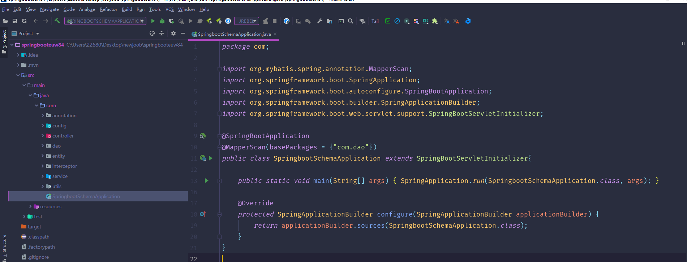

数据库表

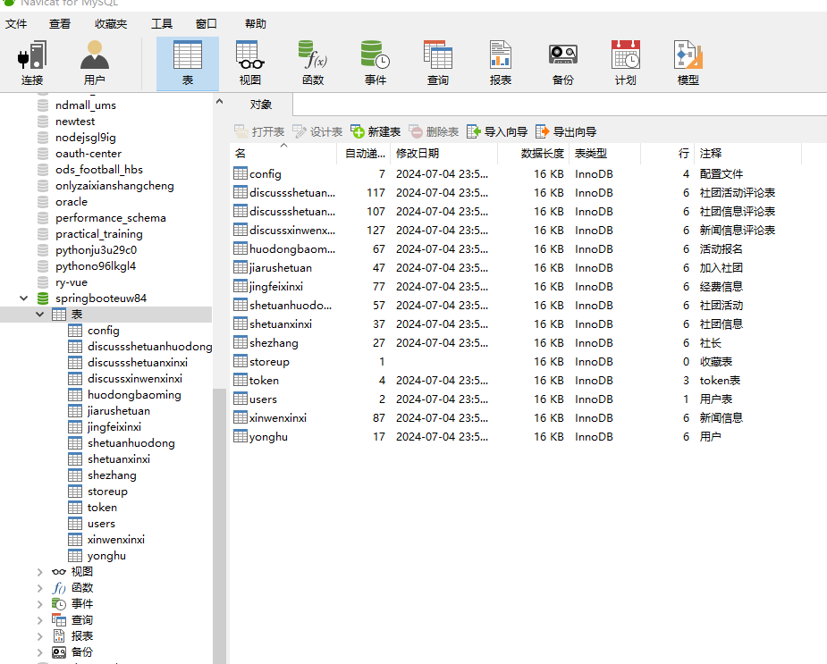

登录

用户管理

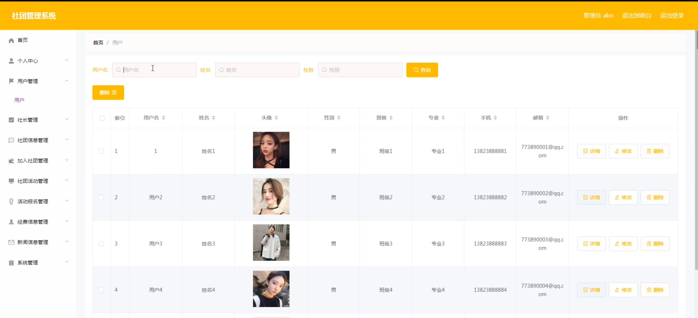

社长管理

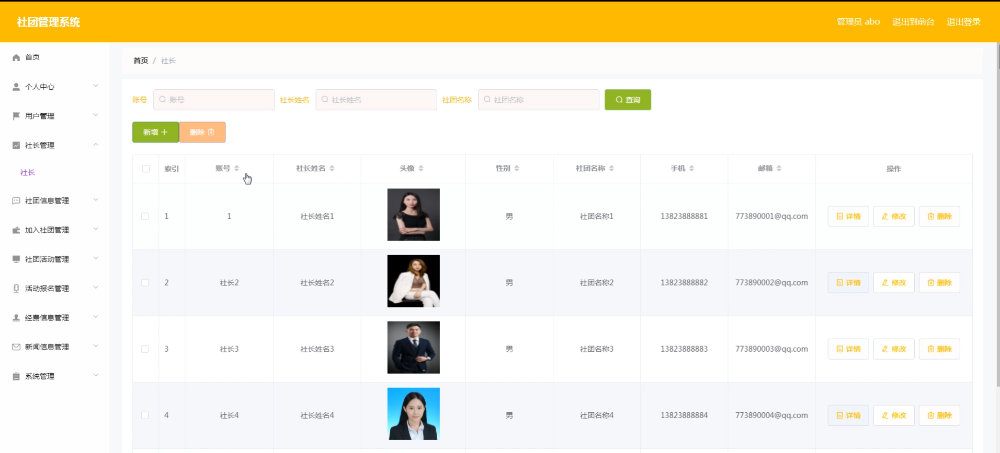

社团信息管理

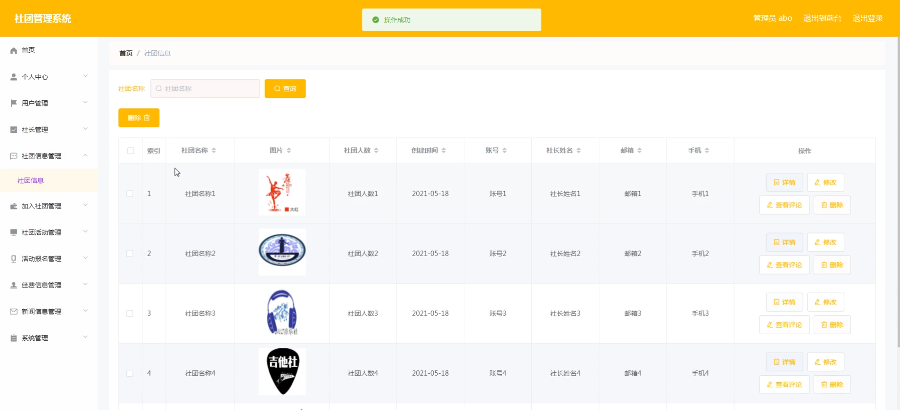

系统管理

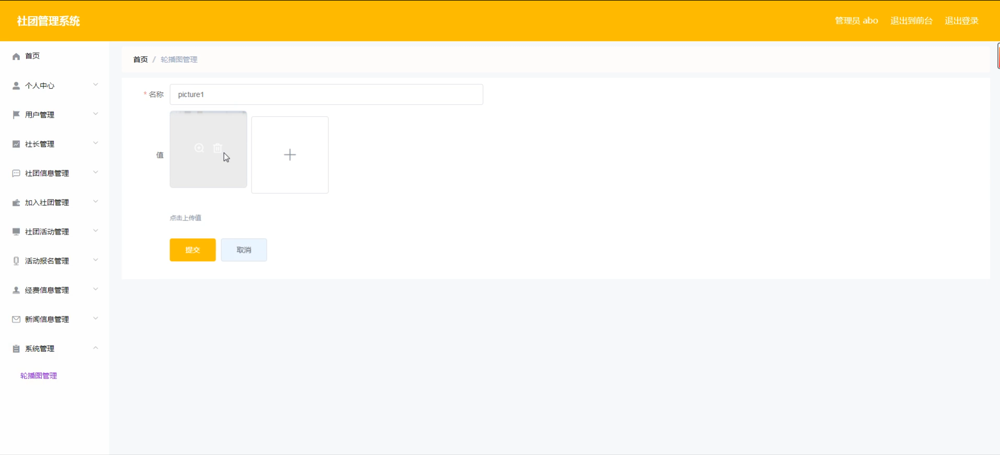

社长端个人信息

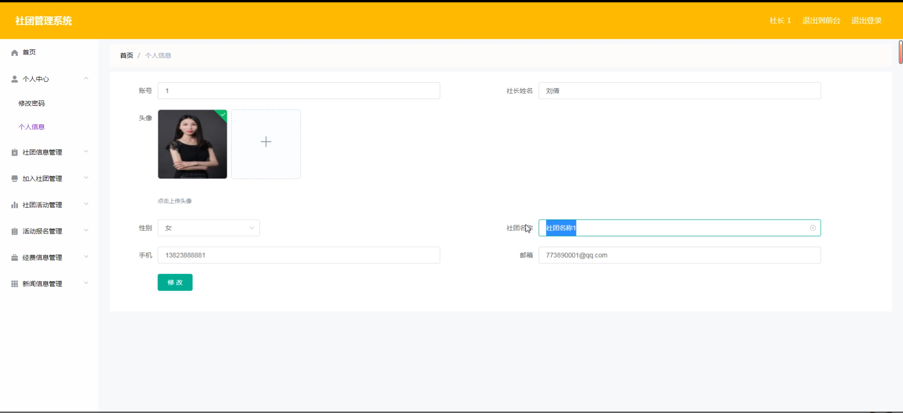

社团信息新增

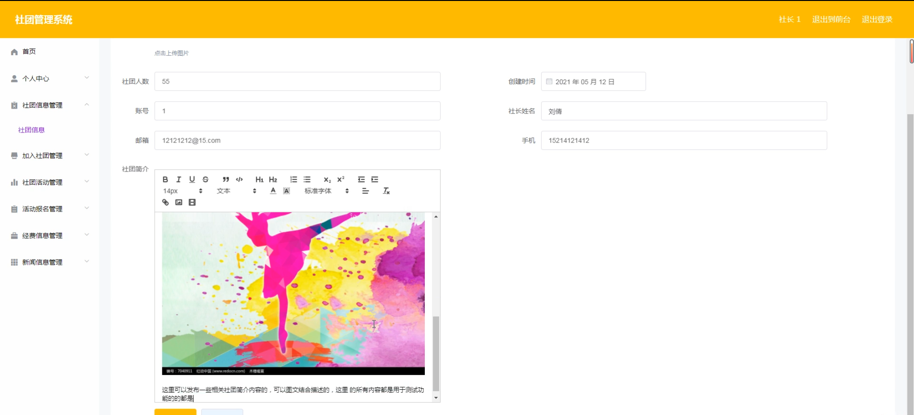

加入社团管理

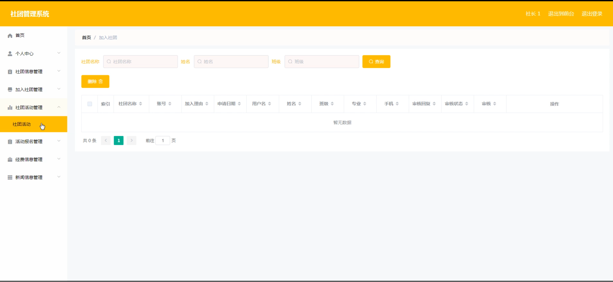

经费信息管理

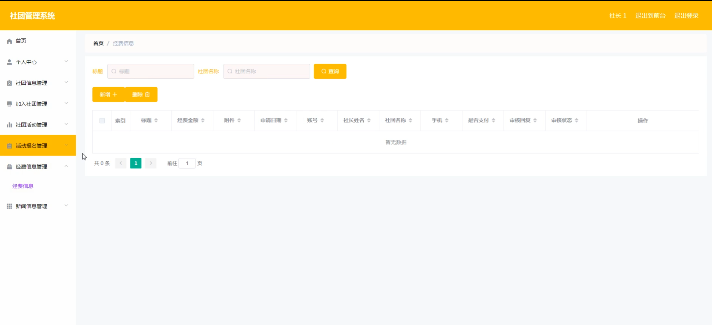

前台页面首页

个人中心

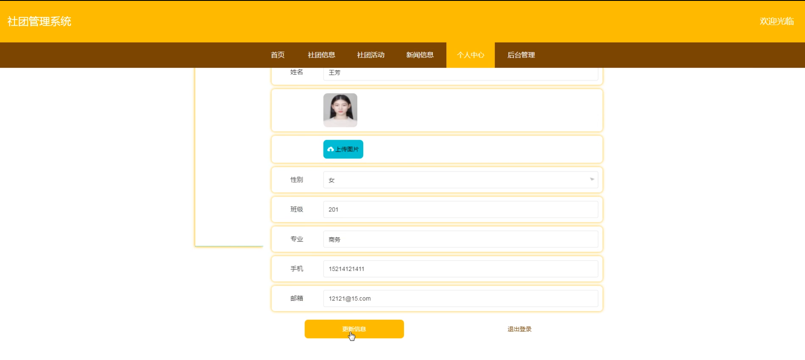

社团活动

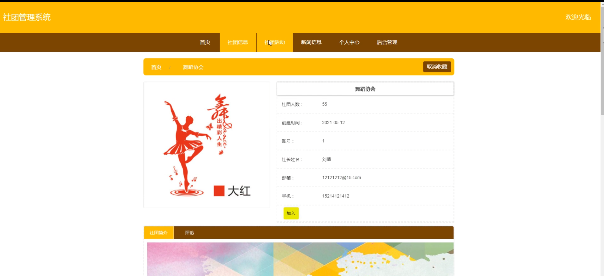

新闻信息

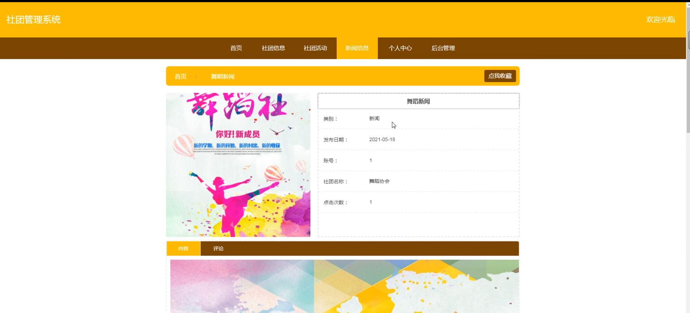

用户端加入社团

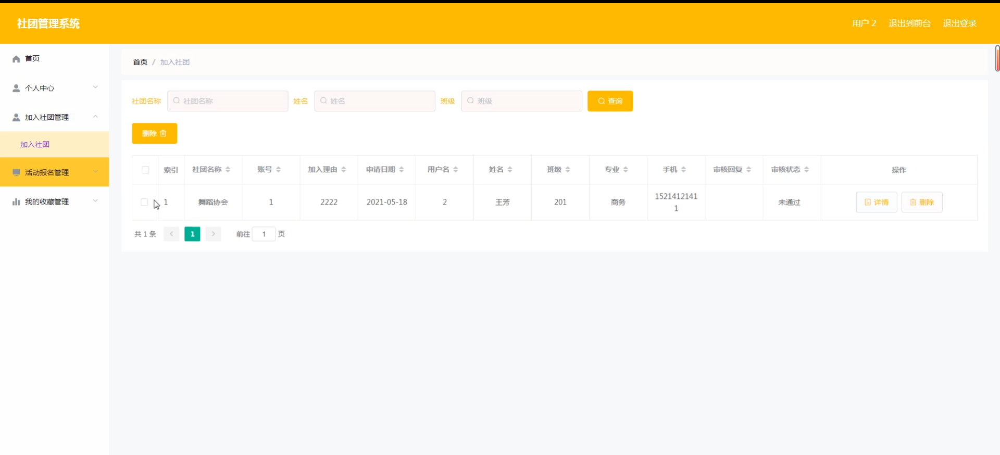

#### 总结

基于Java的社团管理系统通过科学的角色划分和详细的功能模块设计，实现了社团管理的高效化、透明化和便捷化。系统为管理员、社长和用户提供了全面的功能支持，优化了社团信息管理、活动组织和成员交流的流程。通过该系统，社团管理者能够更好地组织和管理社团活动，提升社团的运营效率，同时用户也能够更加方便地获取社团信息和参与社团活动。该系统不仅提升了社团的管理水平，还增强了社团成员的参与感和满意度，为社团的健康发展提供了有力支持。

#### 使用说明

创建数据库，执行数据库脚本 修改jdbc数据库连接参数 下载安装maven依赖jar 启动idea中的springboot项目

后台地址、http://localhost:8080/springbooteuw84/admin/dist/index.html

管理员  abo 密码 abo

前台地址：http://localhost:8080/springbooteuw84/front/index.html
